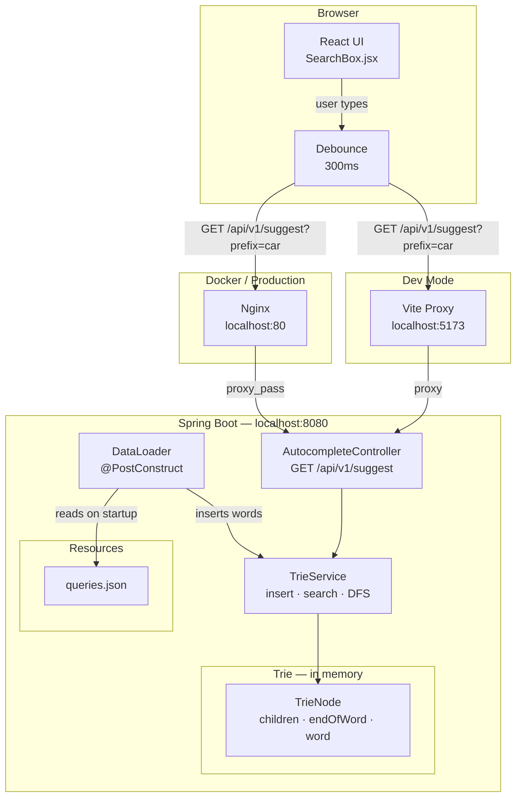
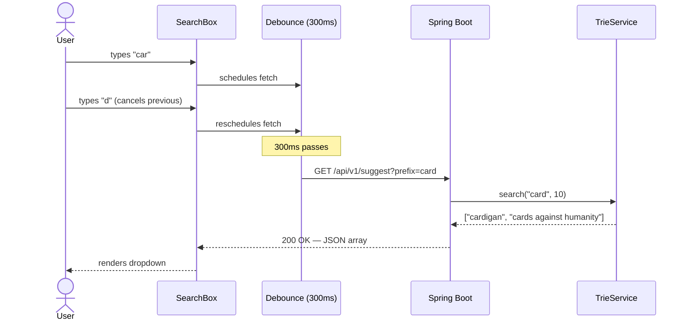
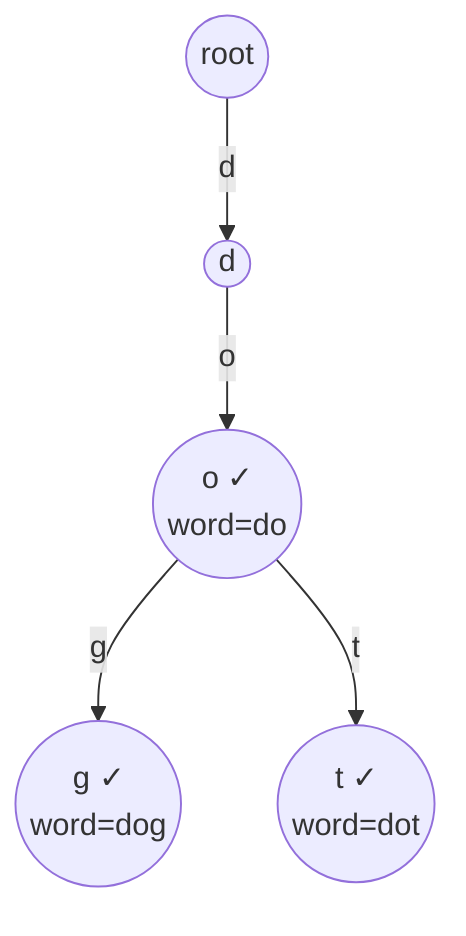
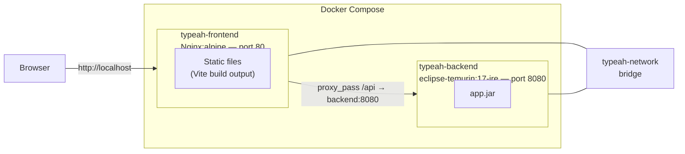

# Architecture — v0.1.0 (Phase 1: Core Autocomplete)

## System Overview

## Request Flow

## Data Structures

## Docker Setup

## Component Responsibilities

| Component | Responsibility |
|---|---|
| `TrieNode` | Holds children map, endOfWord flag, and full word string |
| `TrieService` | Insert, DFS search with limit, blank prefix guard |
| `AutocompleteController` | HTTP layer — validates input, delegates to TrieService |
| `DataLoader` | Reads `queries.json` at startup, populates trie |
| `SearchBox.jsx` | Debounced fetch, renders suggestion dropdown |
| `nginx.conf` | Serves static files, proxies `/api` to backend |